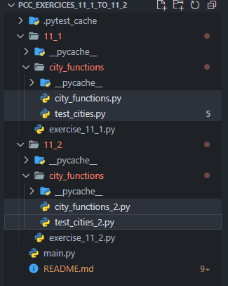
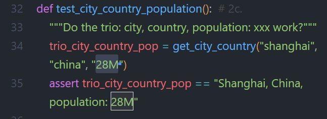

# WHAT I LEARNT

---

## Weird Bug with 2 Test Files in 2 Folders

Because exercise 11-2 is based on the code of 11-1, **I duplicated the whole folder of 11-1** and used it for 11-2. 

And once I finished to write the `test_` functions, which **should return as failed for 11-2, pytest returned all tests as passed**.  

This was unexpected and it took a good 20mn to figure out how to fix this. I tried to **just comment out the test functions** in 11-1 and that did it. 

---

## Test Files Location is Important

After I setup my folder structure, **where my test file would not be located in the functions folder from which they will be calling these functions**, I encountered an error.  
And this is was probably my first mistake in this project. The book did not mention such a thing and I was lucky to having figured it out on my own pretty quickly.  

Just like I hinted it here, **test files should be together with the function files that they need to call**. 

--- 

## How Well Did I do?

After I compared my code to the solutions: 
- **exercise 11-1**:  
  Pretty much the same code shown in the solution.  

  GRADE: High pass.

- **exercise 11-2**:  
  Here too, except for the population parameter that I defined. **I made it a string** by defining it as `population=''`. Which I used by calling it `'28M'`.

  

GRADE: high pass.

---

#### Resources:
Python Crash Course 3rd Ed.: [solutions to exercises 11-1 & 11-2](https://ehmatthes.github.io/pcc_3e/solutions/chapter_11/#11-1-city-country)  
